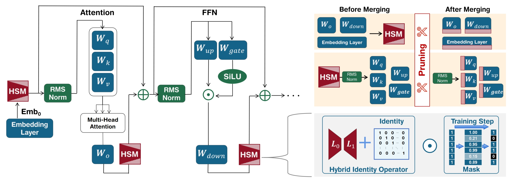
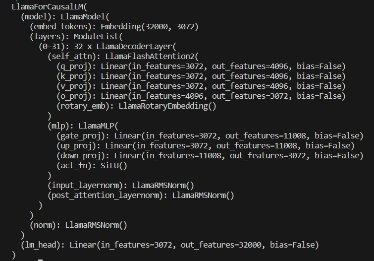

## Introduction
This repo is the official implementation of `PAT: Pruning-Aware Tuning for Large Language Models`. [(arxiv)](https://www.arxiv.org/abs/2408.14721)


## News
- [x] 2024.9 - We merged pruned PAT(25%)-Llama2 which can be loaded by `transformers[with-our-modification]`. [(download)](https://box.nju.edu.cn/d/75ca31eb571448f59401/)

- [x] 2024.8 - We release the paper and code for PAT. [(arxiv)](https://www.arxiv.org/abs/2408.14721)

## Acknowledgment
Modified from [FireFly](https://github.com/yangjianxin1/Firefly)

## Best Practice
```bash
# Create environment
# Note: we have modified some source codes in transformers and peft, please install the packages in this repo!
conda create -n pat python=3.10 -y
conda activate pat
pip install torch==2.3.0 torchvision==0.18.0 torchaudio==2.3.0 --index-url https://download.pytorch.org/whl/cu118
cd transformers-4.40.1
pip install -e .
cd ../peft-0.10.0
pip install -e .
cd ..
pip install -r requirements.txt

# Download dataset in https://box.nju.edu.cn/f/76ae99a847d44fb08cfe/
# The dataset path should be like:
# <PAT Repo>/data/lamini-instruction_0.5_1.3m.parquet
wget https://box.nju.edu.cn/f/76ae99a847d44fb08cfe/?dl=1 -O data/lamini-instruction_0.5_1.3m.parquet

# Pruning Aware Tuning
# Note: --flash2 can be used for acceleration if you have installed flash-attn
CUDA_VISIBLE_DEVICES=0,1,2,3,4,5,6,7 torchrun --nproc_per_node=8 --master_port=29502 train.py \
--train_args_file train_args/sft/lora/llama2-7b-sft-lora-dimdown-learn3072.json \
--ft_mode dimdown \
--global_step 10000 --dimdown_dim 3072 --padding_side left --trainable_mask --identity_loss
```

## Installation
```bash
conda create -n pat python=3.10
pip install torch==2.3.0 torchvision==0.18.0 torchaudio==2.3.0 --index-url https://download.pytorch.org/whl/cu118
cd transformers-4.40.1
pip install -e .
cd ../peft
pip install -e .
cd ..
pip install -r requirements.txt
```

## Datasets
We employ `Lamini-Instruction` for fine-tuning, which can be found [here](https://huggingface.co/datasets/MBZUAI/LaMini-instruction) in HuggingFace. Additionally, we provide our 50% randomly sampled data in this [link](https://box.nju.edu.cn/f/76ae99a847d44fb08cfe/).

## Evaluation
```bash
ADAPTER=<path-to-adaptor>
FT_MODE=dimdown
GPU=0
CUDA_VISIBLE_DEVICES=$GPU python chat.py \
--model_name_or_path meta-llama/Llama-2-7b-hf \
--adapter_name_or_path $ADAPTER \
--template_name llama2-base-alpaca  \
--ft_mode $FT_MODE \
--trainable_mask \
--identity_loss \
--chat debug-all
```

## Model Zoo
We can merge the HSMs after PAT by using `script/merge_dimdown.py`.
```bash
ADAPTER=<path-to-adaptor>
python script/merge_dimdown.py \
--model_dir meta-llama/Llama-2-7b-hf \
--adaptor_path $ADAPTER
```
Additionally, we provide some PAT results [here](https://box.nju.edu.cn/d/75ca31eb571448f59401/).
- [x] Llama 2 7B
- [x] Llama 2 13B
- [x] Gemma 2B
- [x] Gemma 7B
- [x] Yi-1.5 34B
